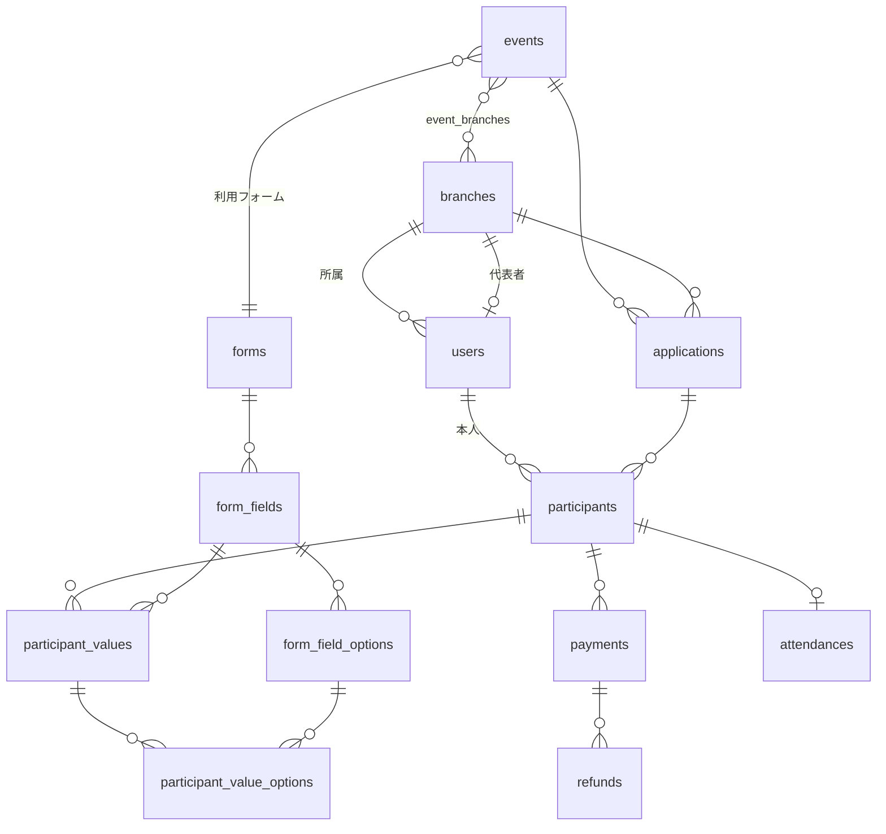

# 神苑スタッフ 参加申込システム データ定義書（v1 ドラフト）

作成日：2026-06-07
前提：要件定義書 v4（確定版）／画面設計書 v1

---

## 1. エンティティ一覧

| ドメイン | テーブル（物理名） | 論理名 |
| --- | --- | --- |
| アカウント・マスタ | users | ユーザー |
| | branches | 拠点マスタ |
| イベント・フォーム | events | イベント |
| | event_branches | イベント対象拠点 |
| | forms | フォーム |
| | form_fields | フォーム項目 |
| | form_field_options | フォーム項目 選択肢 |
| 申込・参加者 | applications | 申込（拠点単位の束） |
| | participants | 参加者（個人） |
| | participant_values | 参加者 入力値 |
| | participant_value_options | 参加者 選択値（選択肢への参照） |
| 決済・返金 | payments | 決済 |
| | refunds | 返金 |
| 受付 | attendances | 受付・出欠 |
| ログ | notification_logs | 通知ログ |
| | audit_logs | 操作ログ |

---

## 2. ER概要



**関連の要点**
- イベント × 拠点 で「申込（applications）」が1件。代表者がこれを確定する。
- 申込の下に「参加者（participants）」が複数。各参加者は users に紐づく個人。
- 金額・決済・受付はすべて participants 単位。
- 合計金額（拠点別・イベント別）は participants.total_amount を SUM して算出（status=支払済を集計）。

---

## 3. テーブル定義

### 3-1. users（ユーザー）
| 論理名 | 物理名 | 型 | キー/制約 | 説明 |
| --- | --- | --- | --- | --- |
| ID | id | BIGINT | PK | |
| 氏名 | name | VARCHAR(100) | NOT NULL | |
| メール | email | VARCHAR(255) | UNIQUE, NOT NULL | ログインID |
| パスワード | password_hash | VARCHAR(255) | NOT NULL | ハッシュ保存 |
| 役割 | role | ENUM | NOT NULL | participant/representative/admin/reception |
| 所属拠点 | branch_id | BIGINT | FK→branches | 参加者・代表者の所属 |
| LINE ID | line_user_id | VARCHAR(100) | NULL | LINE通知用 |
| 状態 | status | ENUM | NOT NULL | active/inactive |
| 登録経路 | created_via | ENUM | NOT NULL | self（自己登録）/proxy（代行発行） |
| 作成日時 | created_at | DATETIME | | |
| 更新日時 | updated_at | DATETIME | | |

### 3-2. branches（拠点マスタ）
| 論理名 | 物理名 | 型 | キー/制約 | 説明 |
| --- | --- | --- | --- | --- |
| ID | id | BIGINT | PK | |
| 拠点名 | name | VARCHAR(100) | NOT NULL | |
| 拠点コード | code | VARCHAR(50) | UNIQUE, NULL | |
| 代表者 | representative_user_id | BIGINT | FK→users, NULL | 拠点ごとに設定 |
| 地域 | region | VARCHAR(100) | NULL | |
| 有効フラグ | is_active | BOOLEAN | NOT NULL | |
| 作成日時 | created_at | DATETIME | | |
| 更新日時 | updated_at | DATETIME | | |

### 3-3. events（イベント）
| 論理名 | 物理名 | 型 | キー/制約 | 説明 |
| --- | --- | --- | --- | --- |
| ID | id | BIGINT | PK | |
| イベント名 | name | VARCHAR(150) | NOT NULL | |
| 開催日 | event_date | DATE | NOT NULL | |
| 申込締切 | application_deadline | DATE | NOT NULL | デフォルト毎月25日 |
| 定員 | capacity | INT | NULL | |
| 利用フォーム | form_id | BIGINT | FK→forms, NOT NULL | |
| 状態 | status | ENUM | NOT NULL | draft/published/closed |
| 複製元 | duplicated_from_event_id | BIGINT | FK→events, NULL | 複製作成時 |
| 作成日時 | created_at | DATETIME | | |
| 更新日時 | updated_at | DATETIME | | |

### 3-4. event_branches（イベント対象拠点）
| 論理名 | 物理名 | 型 | キー/制約 | 説明 |
| --- | --- | --- | --- | --- |
| イベントID | event_id | BIGINT | PK, FK→events | |
| 拠点ID | branch_id | BIGINT | PK, FK→branches | |

### 3-5. forms（フォーム）
| 論理名 | 物理名 | 型 | キー/制約 | 説明 |
| --- | --- | --- | --- | --- |
| ID | id | BIGINT | PK | |
| フォーム名 | name | VARCHAR(150) | NOT NULL | |
| 説明 | description | TEXT | NULL | |
| 作成日時 | created_at | DATETIME | | |
| 更新日時 | updated_at | DATETIME | | |

### 3-6. form_fields（フォーム項目）
| 論理名 | 物理名 | 型 | キー/制約 | 説明 |
| --- | --- | --- | --- | --- |
| ID | id | BIGINT | PK | |
| フォームID | form_id | BIGINT | FK→forms | |
| 項目名 | label | VARCHAR(150) | NOT NULL | |
| 項目タイプ | field_type | ENUM | NOT NULL | text/textarea/select_single/select_multiple/number/date |
| 必須 | is_required | BOOLEAN | NOT NULL | |
| 並び順 | sort_order | INT | NOT NULL | |
| 金額連動 | price_calc_type | ENUM | NOT NULL | none/per_unit（数値×単価）/option_based（選択肢別価格） |
| 単価 | unit_price | DECIMAL(10,0) | NULL | per_unit時に使用 |
| 作成日時 | created_at | DATETIME | | |
| 更新日時 | updated_at | DATETIME | | |

### 3-7. form_field_options（フォーム項目 選択肢）
| 論理名 | 物理名 | 型 | キー/制約 | 説明 |
| --- | --- | --- | --- | --- |
| ID | id | BIGINT | PK | |
| 項目ID | form_field_id | BIGINT | FK→form_fields | |
| 選択肢名 | label | VARCHAR(150) | NOT NULL | |
| 価格 | price | DECIMAL(10,0) | NULL | option_based時の単価 |
| 並び順 | sort_order | INT | NOT NULL | |

### 3-8. applications（申込・拠点単位の束）
| 論理名 | 物理名 | 型 | キー/制約 | 説明 |
| --- | --- | --- | --- | --- |
| ID | id | BIGINT | PK | |
| イベントID | event_id | BIGINT | FK→events | |
| 拠点ID | branch_id | BIGINT | FK→branches | |
| 状態 | status | ENUM | NOT NULL | open（受付中・未確定）/confirmed（確定） |
| 確定日時 | confirmed_at | DATETIME | NULL | |
| 確定者 | confirmed_by_user_id | BIGINT | FK→users, NULL | 代表者 |
| 作成日時 | created_at | DATETIME | | |
| 更新日時 | updated_at | DATETIME | | |

※ UNIQUE(event_id, branch_id)。自己申込時は当該イベント×拠点の申込を find-or-create。

### 3-9. participants（参加者・個人）
| 論理名 | 物理名 | 型 | キー/制約 | 説明 |
| --- | --- | --- | --- | --- |
| ID | id | BIGINT | PK | |
| 申込ID | application_id | BIGINT | FK→applications | |
| ユーザーID | user_id | BIGINT | FK→users | 本人 |
| 状態 | status | ENUM | NOT NULL | applying/confirmed/paid/cancelled |
| 合計金額 | total_amount | DECIMAL(10,0) | NOT NULL | 入力値から算出・保存 |
| 入力経路 | entered_via | ENUM | NOT NULL | self/proxy |
| 代行入力者 | entered_by_user_id | BIGINT | FK→users, NULL | proxy時の代表者 |
| キャンセル日時 | cancelled_at | DATETIME | NULL | |
| キャンセル理由 | cancel_reason | VARCHAR(255) | NULL | |
| 作成日時 | created_at | DATETIME | | |
| 更新日時 | updated_at | DATETIME | | |

### 3-10. participant_values（参加者 入力値）
| 論理名 | 物理名 | 型 | キー/制約 | 説明 |
| --- | --- | --- | --- | --- |
| ID | id | BIGINT | PK | |
| 参加者ID | participant_id | BIGINT | FK→participants | |
| 項目ID | form_field_id | BIGINT | FK→form_fields | |
| 値（文字/数値/日付） | value | VARCHAR(500) | NULL | text/number/date を格納 |

### 3-11. participant_value_options（参加者 選択値）
| 論理名 | 物理名 | 型 | キー/制約 | 説明 |
| --- | --- | --- | --- | --- |
| 入力値ID | participant_value_id | BIGINT | PK, FK→participant_values | |
| 選択肢ID | form_field_option_id | BIGINT | PK, FK→form_field_options | 単一/複数選択に対応 |

### 3-12. payments（決済）
| 論理名 | 物理名 | 型 | キー/制約 | 説明 |
| --- | --- | --- | --- | --- |
| ID | id | BIGINT | PK | |
| 参加者ID | participant_id | BIGINT | FK→participants | |
| 金額 | amount | DECIMAL(10,0) | NOT NULL | |
| 決済手段 | method | ENUM | NULL | credit_card/paypay |
| 状態 | status | ENUM | NOT NULL | requested（依頼済・未払）/completed（支払済）/failed/refunded |
| 決済代行 | provider | VARCHAR(50) | NULL | |
| 代行取引ID | provider_transaction_id | VARCHAR(100) | NULL | |
| 決済リンクトークン | payment_link_token | VARCHAR(100) | NULL | メール送付リンク |
| リンク有効期限 | payment_link_expires_at | DATETIME | NULL | |
| 決済日時 | paid_at | DATETIME | NULL | |
| 作成日時 | created_at | DATETIME | | |
| 更新日時 | updated_at | DATETIME | | |

### 3-13. refunds（返金）
| 論理名 | 物理名 | 型 | キー/制約 | 説明 |
| --- | --- | --- | --- | --- |
| ID | id | BIGINT | PK | |
| 決済ID | payment_id | BIGINT | FK→payments | |
| 返金額 | amount | DECIMAL(10,0) | NOT NULL | 原則全額 |
| 理由 | reason | VARCHAR(255) | NULL | |
| 返金実行者 | refunded_by_user_id | BIGINT | FK→users | |
| 代行返金ID | provider_refund_id | VARCHAR(100) | NULL | |
| 返金日時 | refunded_at | DATETIME | NOT NULL | |

### 3-14. attendances（受付・出欠）
| 論理名 | 物理名 | 型 | キー/制約 | 説明 |
| --- | --- | --- | --- | --- |
| ID | id | BIGINT | PK | |
| 参加者ID | participant_id | BIGINT | FK→participants, UNIQUE | |
| 状態 | status | ENUM | NOT NULL | not_arrived/checked_in/day_cancelled |
| 受付日時 | checked_in_at | DATETIME | NULL | |
| 受付担当 | received_by_user_id | BIGINT | FK→users, NULL | |
| 受付方法 | method | ENUM | NULL | qr/name_search |
| 作成日時 | created_at | DATETIME | | |
| 更新日時 | updated_at | DATETIME | | |

### 3-15. notification_logs（通知ログ）
| 論理名 | 物理名 | 型 | キー/制約 | 説明 |
| --- | --- | --- | --- | --- |
| ID | id | BIGINT | PK | |
| 宛先ユーザー | user_id | BIGINT | FK→users | |
| 参加者ID | participant_id | BIGINT | FK→participants, NULL | |
| 種別 | type | ENUM | NOT NULL | application_complete/payment_request/payment_reminder/payment_complete/cancellation/refund |
| チャネル | channel | ENUM | NOT NULL | email/line |
| 送信先 | destination | VARCHAR(255) | NOT NULL | |
| 状態 | status | ENUM | NOT NULL | sent/failed |
| 送信日時 | sent_at | DATETIME | NULL | |
| 作成日時 | created_at | DATETIME | | |

### 3-16. audit_logs（操作ログ）
| 論理名 | 物理名 | 型 | キー/制約 | 説明 |
| --- | --- | --- | --- | --- |
| ID | id | BIGINT | PK | |
| 操作者 | actor_user_id | BIGINT | FK→users | |
| 操作 | action | VARCHAR(50) | NOT NULL | confirm/edit/cancel/refund/checkin 等 |
| 対象種別 | target_type | VARCHAR(50) | NOT NULL | participant/application/event 等 |
| 対象ID | target_id | BIGINT | NOT NULL | |
| 詳細 | detail | TEXT | NULL | 変更前後など（JSON可） |
| 作成日時 | created_at | DATETIME | | |

---

## 4. 区分値（enum）一覧

- **users.role**：participant（参加者）/ representative（代表者）/ admin（管理者）/ reception（受付）
- **events.status**：draft（下書き）/ published（公開）/ closed（締切済）
- **form_fields.field_type**：text / textarea / select_single / select_multiple / number / date
- **form_fields.price_calc_type**：none（金額連動なし）/ per_unit（数値×単価）/ option_based（選択肢別価格）
- **applications.status**：open（受付中）/ confirmed（確定）
- **participants.status**：applying（申込中）/ confirmed（確定）/ paid（支払済）/ cancelled（キャンセル）
- **payments.method**：credit_card / paypay
- **payments.status**：requested（依頼済・未払）/ completed（支払済）/ failed / refunded
- **attendances.status**：not_arrived（未来場）/ checked_in（来場済）/ day_cancelled（当日キャンセル）

---

## 5. ステータス遷移

**参加者（participants.status）**
```
applying ──(代表者が名簿確定)──▶ confirmed ──(決済完了)──▶ paid
   │                                  │                       │
   └──────────────── cancelled ◀──────┴───────────────────────┘
   ※ paid からのキャンセルは refunds を伴う（当日=返金なし／前日まで=全額）
```

**決済（payments.status）**
```
requested ──(本人が決済)──▶ completed ──(返金)──▶ refunded
     └──(失敗)──▶ failed
```

---

## 6. 金額計算の考え方

- 各参加者の `total_amount` ＝ フォーム項目のうち金額連動項目の合計。
  - `per_unit`：入力数値 × `form_fields.unit_price`
  - `option_based`：選択された `form_field_options.price` の合計
- 入力・修正のたびに再計算して保存。
- 拠点別・イベント別・全体の合計は `participants.total_amount` を `status=paid` で SUM して算出（集計用テーブルは持たない）。

---

## 7. 残課題

- 金額計算ロジックの詳細（端数処理、上限・割引などの有無）
- 決済代行サービス確定後の payments 項目の精緻化（provider固有のフィールド）
- 多言語・項目バリデーションルールの定義

---

*本書はデータ定義の v1 ドラフトです。確定後、DDL（CREATE文）やマイグレーションへ展開できます。*
