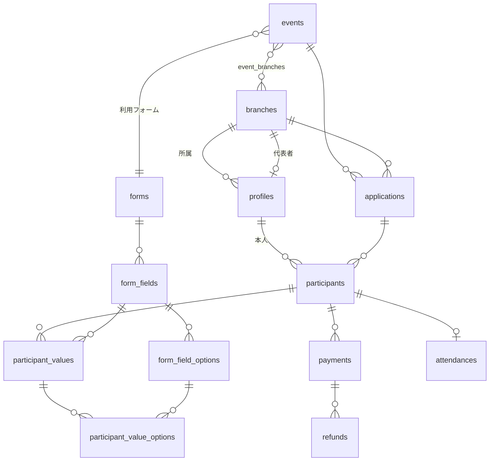

# 神苑（misono）スタッフ参加申込システム データ定義書（v2 / Supabase + Stripe 対応版）

作成日：2026-06-07
前提：要件定義書 v4（確定版）／データ定義書 v1（ドラフト）／画面設計書 v1
技術構成：**Next.js + Supabase（PostgreSQL / Auth / RLS）+ Stripe**

> v1 からの主な変更点は「§0 改訂方針」を参照。本書は実装（DDL / マイグレーション / RLS）に直接展開できる粒度を目指す。

---

## 0. 改訂方針（v1 → v2 差分）

| # | 変更 | 理由 |
| --- | --- | --- |
| 1 | **PK を `BIGINT` → `UUID`（`gen_random_uuid()`）** に統一 | Supabaseの慣例。ID推測によるリソース列挙を防ぎセキュリティ向上 |
| 2 | **`users` を Supabase Auth と連携**。認証情報（メール/パスワード）は `auth.users` が保持し、`public.users` は `auth.users.id` を参照するプロフィールに | 認証の二重管理を排除。`password_hash` カラムを廃止 |
| 3 | **全テーブルに RLS 前提のアクセス制御方針を明記**（§3 各表 + §8） | 参加者=自分／代表者=自拠点／管理者=全件 を要件どおりDBで強制 |
| 4 | 日時型を **`TIMESTAMPTZ`**、日付は `DATE`、`created_at/updated_at` にデフォルト・トリガ | タイムゾーン安全。SupTbase標準 |
| 5 | **Stripe固有フィールドを `payments`/`refunds` に追加**（payment_intent / checkout_session / customer / refund_id） | Stripe連携の運用に必要。汎用 `provider_*` は廃止 |
| 6 | `payments.payment_link_token` を **廃止**、Stripe Checkout Session URL を利用 | 自前リンク管理が不要に |
| 7 | 金額型を `DECIMAL(10,0)` → **`INTEGER`（円・最小単位）** | 日本円は小数なし。Stripeも最小単位の整数で扱う |
| 8 | enum を **PostgreSQL の `CREATE TYPE`（enum型）** で定義 | 型安全。§4参照 |
| 9 | `role` を `users` の単一カラムに保持しつつ、判定用に `app_metadata` への複製を併用（RLS高速化） | RLSポリシーで `auth.jwt()` から役割参照するため |

### 0.1 v2.1 追補（複数イベント参加・1スキャン一括受付）

同日に複数イベントが開催され、1人が複数イベントに参加するケースに対応。UX簡素化のため以下を追加・変更（詳細フローは `設計追補_複数イベント参加・一括受付.md`）。

| # | 変更 | 理由 |
| --- | --- | --- |
| A | `profiles.checkin_token`（UUID）追加 | 当日受付QRを**人単位**にし、1スキャンで当日の全参加イベントを一括受付するため |
| B | `events.venue` 追加 | 同日複数会場の受付スコープ（日付＋会場で束ねる。開催回エンティティは導入しない） |
| C | **まとめ決済**：`payment_groups` 新設、`payments` を「グループ内のイベント按分」へ変更 | 1回のStripe Checkoutで複数イベント分をまとめて決済。返金はイベント単位で部分返金 |
| D | 受付RPC（`checkin_candidates`/`batch_check_in`/`mark_day_cancelled`）追加 | 一括受付・個別当日キャンセルを安全に実行（RLS準拠） |

> 申込の簡素化（複数イベントを1フローで申込・共通プロフィール再利用）は **画面/アプリ層**で実現し、DBは「イベント×拠点ごとの applications + participants」を維持（開催回テーブルは作らず `event_date`＋`venue` で束ねる）。

---

## 1. エンティティ一覧

| ドメイン | テーブル（物理名） | 論理名 |
| --- | --- | --- |
| アカウント・マスタ | profiles | ユーザープロフィール（auth.users連携） |
| | branches | 拠点マスタ |
| イベント・フォーム | events | イベント |
| | event_branches | イベント対象拠点 |
| | forms | フォーム |
| | form_fields | フォーム項目 |
| | form_field_options | フォーム項目 選択肢 |
| 申込・参加者 | applications | 申込（拠点単位の束） |
| | participants | 参加者（個人） |
| | participant_values | 参加者 入力値 |
| | participant_value_options | 参加者 選択値 |
| 決済・返金 | payment_groups | 決済グループ（Stripe取引・まとめ決済） |
| | payments | 決済按分（イベント単位） |
| | refunds | 返金（Stripe） |
| 受付 | attendances | 受付・出欠 |
| ログ | notification_logs | 通知ログ |
| | audit_logs | 操作ログ |

---

## 2. ER概要



**関連の要点**
- イベント × 拠点 で「申込（applications）」が1件（UNIQUE(event_id, branch_id)）。代表者が確定する。
- 申込の下に「参加者（participants）」が複数。各参加者は `profiles`（＝`auth.users`）に紐づく個人。
- 金額・決済・受付はすべて participants 単位。
- 合計金額は `participants.total_amount` を `status='paid'` で SUM して算出（集計テーブルは持たない）。

---

## 3. テーブル定義

> 凡例：型は PostgreSQL。`PK`=主キー、`FK`=外部キー。`created_at`/`updated_at` は全表共通で `TIMESTAMPTZ DEFAULT now()`（以降の表では省略）。`RLS` 行に各表のアクセス方針を記載。

### 3-1. profiles（ユーザープロフィール）
`auth.users` と 1:1。`id` は `auth.users.id` を参照（認証・メール・パスワードは `auth.users` 側）。

| 論理名 | 物理名 | 型 | キー/制約 | 説明 |
| --- | --- | --- | --- | --- |
| ID | id | UUID | PK, FK→auth.users.id | auth.usersと共有 |
| 氏名 | name | VARCHAR(100) | NOT NULL | |
| 読み仮名 | kana | VARCHAR(100) | NOT NULL | 氏名のふりがな |
| 役割 | role | user_role | NOT NULL | participant/representative/admin/reception |
| 部 | division | division | NULL | 学生部/大学生部/成人部/男子部/一般 |
| 所属拠点 | branch_id | UUID | FK→branches, NULL | 参加者・代表者の所属 |
| LINE ID | line_user_id | VARCHAR(100) | NULL | LINE通知用 |
| 状態 | status | account_status | NOT NULL DEFAULT 'active' | active/inactive |
| 登録経路 | created_via | created_via | NOT NULL | self/proxy |
| 受付トークン | checkin_token | UUID | NOT NULL UNIQUE DEFAULT gen_random_uuid() | 当日受付QR（人単位・1スキャンで複数イベント受付） |

> ※ メールは `auth.users.email` を参照（重複保持しない）。`role` は RLS 高速化のため `auth.users.app_metadata.role` にも複製（更新はトリガ or サーバ関数で同期）。
> **RLS**：本人は自分の行を SELECT/UPDATE 可（role/branch_id は変更不可）。管理者は全件。代表者は自拠点メンバーを SELECT 可。

### 3-2. branches（拠点マスタ）
| 論理名 | 物理名 | 型 | キー/制約 | 説明 |
| --- | --- | --- | --- | --- |
| ID | id | UUID | PK | |
| 拠点名 | name | VARCHAR(100) | NOT NULL | |
| 拠点コード | code | VARCHAR(50) | UNIQUE, NULL | |
| 代表者 | representative_user_id | UUID | FK→profiles, NULL | 拠点ごとに設定 |
| 地域 | region | VARCHAR(100) | NULL | |
| 有効フラグ | is_active | BOOLEAN | NOT NULL DEFAULT true | |

> **RLS**：認証済みユーザは SELECT 可（拠点選択UIで使用）。INSERT/UPDATE/DELETE は管理者のみ。

### 3-3. events（イベント）
| 論理名 | 物理名 | 型 | キー/制約 | 説明 |
| --- | --- | --- | --- | --- |
| ID | id | UUID | PK | |
| イベント名 | name | VARCHAR(150) | NOT NULL | |
| 開催日 | event_date | DATE | NOT NULL | 受付は日付で束ねる |
| 会場 | venue | VARCHAR(150) | NULL | 同日複数会場の受付スコープ用 |
| 申込締切 | application_deadline | DATE | NOT NULL | デフォルト毎月25日 |
| 定員 | capacity | INTEGER | NULL | |
| 利用フォーム | form_id | UUID | FK→forms, NOT NULL | |
| 状態 | status | event_status | NOT NULL DEFAULT 'draft' | draft/published/closed |
| 複製元 | duplicated_from_event_id | UUID | FK→events, NULL | 複製作成時 |

> **RLS**：認証済みユーザは `status='published'` を SELECT 可。全操作（含むdraft閲覧）は管理者のみ。

### 3-4. event_branches（イベント対象拠点）
| 論理名 | 物理名 | 型 | キー/制約 | 説明 |
| --- | --- | --- | --- | --- |
| イベントID | event_id | UUID | PK, FK→events | |
| 拠点ID | branch_id | UUID | PK, FK→branches | |

> **RLS**：認証済みユーザ SELECT 可。INSERT/DELETE は管理者のみ。

### 3-5. forms（フォーム）
| 論理名 | 物理名 | 型 | キー/制約 | 説明 |
| --- | --- | --- | --- | --- |
| ID | id | UUID | PK | |
| フォーム名 | name | VARCHAR(150) | NOT NULL | |
| 説明 | description | TEXT | NULL | |

> **RLS**：認証済みユーザ SELECT 可。編集は管理者のみ。

### 3-6. form_fields（フォーム項目）
| 論理名 | 物理名 | 型 | キー/制約 | 説明 |
| --- | --- | --- | --- | --- |
| ID | id | UUID | PK | |
| フォームID | form_id | UUID | FK→forms | |
| 項目名 | label | VARCHAR(150) | NOT NULL | |
| 項目タイプ | field_type | field_type | NOT NULL | text/textarea/select_single/select_multiple/number/date |
| 必須 | is_required | BOOLEAN | NOT NULL DEFAULT false | |
| 並び順 | sort_order | INTEGER | NOT NULL | |
| 金額連動 | price_calc_type | price_calc_type | NOT NULL DEFAULT 'none' | none/per_unit/option_based |
| 単価 | unit_price | INTEGER | NULL | per_unit時（円） |

> **RLS**：認証済みユーザ SELECT 可。編集は管理者のみ。

### 3-7. form_field_options（フォーム項目 選択肢）
| 論理名 | 物理名 | 型 | キー/制約 | 説明 |
| --- | --- | --- | --- | --- |
| ID | id | UUID | PK | |
| 項目ID | form_field_id | UUID | FK→form_fields | |
| 選択肢名 | label | VARCHAR(150) | NOT NULL | |
| 価格 | price | INTEGER | NULL | option_based時の単価（円） |
| 並び順 | sort_order | INTEGER | NOT NULL | |

> **RLS**：認証済みユーザ SELECT 可。編集は管理者のみ。

### 3-8. applications（申込・拠点単位の束）
| 論理名 | 物理名 | 型 | キー/制約 | 説明 |
| --- | --- | --- | --- | --- |
| ID | id | UUID | PK | |
| イベントID | event_id | UUID | FK→events | |
| 拠点ID | branch_id | UUID | FK→branches | |
| 状態 | status | application_status | NOT NULL DEFAULT 'open' | open/confirmed |
| 確定日時 | confirmed_at | TIMESTAMPTZ | NULL | |
| 確定者 | confirmed_by_user_id | UUID | FK→profiles, NULL | 代表者 |

> 制約：**UNIQUE(event_id, branch_id)**。自己申込時は find-or-create。
> **RLS**：参加者は自分が属する申込を SELECT 可。代表者は自拠点の申込を SELECT/UPDATE（確定）可。管理者は全件。

### 3-9. participants（参加者・個人）
| 論理名 | 物理名 | 型 | キー/制約 | 説明 |
| --- | --- | --- | --- | --- |
| ID | id | UUID | PK | |
| 申込ID | application_id | UUID | FK→applications | |
| ユーザーID | user_id | UUID | FK→profiles | 本人 |
| 状態 | status | participant_status | NOT NULL DEFAULT 'applying' | applying/confirmed/paid/cancelled |
| 合計金額 | total_amount | INTEGER | NOT NULL DEFAULT 0 | 円。入力値から算出・保存 |
| 入力経路 | entered_via | entered_via | NOT NULL | self/proxy |
| 代行入力者 | entered_by_user_id | UUID | FK→profiles, NULL | proxy時の代表者 |
| キャンセル日時 | cancelled_at | TIMESTAMPTZ | NULL | |
| キャンセル理由 | cancel_reason | VARCHAR(255) | NULL | |

> 制約：UNIQUE(application_id, user_id)（同一申込に同一人物の重複防止）。
> **RLS**：本人は自分の participant を SELECT 可（修正・削除は不可＝要件14）。代表者は自拠点、管理者は全件で SELECT/INSERT/UPDATE/DELETE 可。

### 3-10. participant_values（参加者 入力値）
| 論理名 | 物理名 | 型 | キー/制約 | 説明 |
| --- | --- | --- | --- | --- |
| ID | id | UUID | PK | |
| 参加者ID | participant_id | UUID | FK→participants | |
| 項目ID | form_field_id | UUID | FK→form_fields | |
| 値 | value | VARCHAR(500) | NULL | text/number/date を格納 |

> 制約：UNIQUE(participant_id, form_field_id)。
> **RLS**：親 participant の可視性に従う（本人SELECT、代表者/管理者は編集可）。

### 3-11. participant_value_options（参加者 選択値）
| 論理名 | 物理名 | 型 | キー/制約 | 説明 |
| --- | --- | --- | --- | --- |
| 入力値ID | participant_value_id | UUID | PK, FK→participant_values | |
| 選択肢ID | form_field_option_id | UUID | PK, FK→form_field_options | 単一/複数選択に対応 |

> **RLS**：親 participant_values に従う。

### 3-12. payment_groups（決済グループ / Stripe取引・まとめ決済）
1回の Stripe Checkout（PaymentIntent 1件）= 1グループ。1人が複数イベント分をまとめて決済する単位。

| 論理名 | 物理名 | 型 | キー/制約 | 説明 |
| --- | --- | --- | --- | --- |
| ID | id | UUID | PK | |
| 支払者 | user_id | UUID | FK→profiles | 本人 |
| 合計金額 | total_amount | INTEGER | NOT NULL | 円（按分合計） |
| 決済手段 | method | payment_method | NULL | credit_card/paypay |
| 状態 | status | payment_status | NOT NULL DEFAULT 'requested' | requested/completed/failed/refunded |
| Stripe顧客ID | stripe_customer_id | VARCHAR(100) | NULL | cus_xxx |
| Checkout Session ID | stripe_checkout_session_id | VARCHAR(100) | NULL | cs_xxx |
| PaymentIntent ID | stripe_payment_intent_id | VARCHAR(100) | UNIQUE, NULL | pi_xxx（冪等性キー） |
| Checkout URL | checkout_url | TEXT | NULL | メール送付リンク（Session URL） |
| リンク有効期限 | checkout_expires_at | TIMESTAMPTZ | NULL | Session の有効期限 |
| 決済日時 | paid_at | TIMESTAMPTZ | NULL | |

> **RLS**：本人(user_id)・管理者が SELECT 可。書込は service_role のみ。

### 3-12b. payments（決済按分 / イベント単位）
payment_group 内の「イベント(participant)ごとの内訳」。1 participant につき1行。

| 論理名 | 物理名 | 型 | キー/制約 | 説明 |
| --- | --- | --- | --- | --- |
| ID | id | UUID | PK | |
| 決済グループID | payment_group_id | UUID | FK→payment_groups | |
| 参加者ID | participant_id | UUID | FK→participants, UNIQUE | このイベントの参加者 |
| 金額 | amount | INTEGER | NOT NULL | 円（このイベント分） |
| 状態 | status | payment_status | NOT NULL DEFAULT 'requested' | イベント単位（個別返金で refunded に） |
| 返金累計 | refunded_amount | INTEGER | NOT NULL DEFAULT 0 | 部分返金の累計 |

> **RLS**：本人(participant所有者)・自拠点代表者・管理者が SELECT 可。書込は service_role のみ。
> ※ Stripe Webhook（`checkout.session.completed`）で group/payments の `status`/`paid_at`/`method` を更新し、対象 participants を `paid` に。

### 3-13. refunds（返金 / Stripe）
イベント単位（= payments 1行）に対する返金。同一 PaymentIntent への部分返金で実現。

| 論理名 | 物理名 | 型 | キー/制約 | 説明 |
| --- | --- | --- | --- | --- |
| ID | id | UUID | PK | |
| 決済ID | payment_id | UUID | FK→payments | イベント按分行 |
| 返金額 | amount | INTEGER | NOT NULL | 原則全額（円） |
| 理由 | reason | VARCHAR(255) | NULL | |
| 返金実行者 | refunded_by_user_id | UUID | FK→profiles | |
| Stripe返金ID | stripe_refund_id | VARCHAR(100) | UNIQUE, NULL | re_xxx |
| 返金日時 | refunded_at | TIMESTAMPTZ | NOT NULL DEFAULT now() | |

> **RLS**：SELECT は管理者/該当本人。INSERT はサービスロール（管理者操作のサーバ関数）経由のみ。

### 3-14. attendances（受付・出欠）
| 論理名 | 物理名 | 型 | キー/制約 | 説明 |
| --- | --- | --- | --- | --- |
| ID | id | UUID | PK | |
| 参加者ID | participant_id | UUID | FK→participants, UNIQUE | |
| 状態 | status | attendance_status | NOT NULL DEFAULT 'not_arrived' | not_arrived/checked_in/day_cancelled |
| 受付日時 | checked_in_at | TIMESTAMPTZ | NULL | |
| 受付担当 | received_by_user_id | UUID | FK→profiles, NULL | |
| 受付方法 | method | attendance_method | NULL | qr/name_search |

> **RLS**：受付担当・代表者・管理者が SELECT/INSERT/UPDATE 可。本人は自分の出欠を SELECT 可。

### 3-15. notification_logs（通知ログ）
| 論理名 | 物理名 | 型 | キー/制約 | 説明 |
| --- | --- | --- | --- | --- |
| ID | id | UUID | PK | |
| 宛先ユーザー | user_id | UUID | FK→profiles | |
| 参加者ID | participant_id | UUID | FK→participants, NULL | |
| 種別 | type | notification_type | NOT NULL | application_complete/payment_request/payment_reminder/payment_complete/cancellation/refund |
| チャネル | channel | notification_channel | NOT NULL | email/line |
| 送信先 | destination | VARCHAR(255) | NOT NULL | |
| 状態 | status | notification_status | NOT NULL | sent/failed |
| 送信日時 | sent_at | TIMESTAMPTZ | NULL | |

> **RLS**：SELECT は管理者のみ。INSERT はサービスロールのみ。

### 3-16. audit_logs（操作ログ）
| 論理名 | 物理名 | 型 | キー/制約 | 説明 |
| --- | --- | --- | --- | --- |
| ID | id | UUID | PK | |
| 操作者 | actor_user_id | UUID | FK→profiles | |
| 操作 | action | VARCHAR(50) | NOT NULL | confirm/edit/cancel/refund/checkin 等 |
| 対象種別 | target_type | VARCHAR(50) | NOT NULL | participant/application/event 等 |
| 対象ID | target_id | UUID | NOT NULL | |
| 詳細 | detail | JSONB | NULL | 変更前後など |

> **RLS**：SELECT は管理者のみ。INSERT はサービスロール/トリガのみ（改ざん防止）。

---

## 4. 区分値（PostgreSQL enum 型）

```sql
CREATE TYPE user_role            AS ENUM ('participant','representative','admin','reception');
CREATE TYPE division             AS ENUM ('student','university','adult','mens','general'); -- 学生部/大学生部/成人部/男子部/一般
CREATE TYPE account_status       AS ENUM ('active','inactive');
CREATE TYPE created_via          AS ENUM ('self','proxy');
CREATE TYPE entered_via          AS ENUM ('self','proxy');
CREATE TYPE event_status         AS ENUM ('draft','published','closed');
CREATE TYPE field_type           AS ENUM ('text','textarea','select_single','select_multiple','number','date');
CREATE TYPE price_calc_type      AS ENUM ('none','per_unit','option_based');
CREATE TYPE application_status    AS ENUM ('open','confirmed');
CREATE TYPE participant_status    AS ENUM ('applying','confirmed','paid','cancelled');
CREATE TYPE payment_method        AS ENUM ('credit_card','paypay');
CREATE TYPE payment_status        AS ENUM ('requested','completed','failed','refunded');
CREATE TYPE attendance_status     AS ENUM ('not_arrived','checked_in','day_cancelled');
CREATE TYPE attendance_method     AS ENUM ('qr','name_search');
CREATE TYPE notification_type     AS ENUM ('application_complete','payment_request','payment_reminder','payment_complete','cancellation','refund');
CREATE TYPE notification_channel  AS ENUM ('email','line');
CREATE TYPE notification_status   AS ENUM ('sent','failed');
```

---

## 5. ステータス遷移

**参加者（participants.status）**
```
applying ──(代表者が名簿確定)──▶ confirmed ──(決済完了/Webhook)──▶ paid
   │                                  │                              │
   └──────────────── cancelled ◀──────┴──────────────────────────────┘
   ※ paid からのキャンセルは refunds を伴う（当日=返金なし／前日まで=全額）
```

**決済（payments.status）**
```
requested ──(本人がCheckoutで決済→Webhook)──▶ completed ──(返金)──▶ refunded
     └──(失敗)──▶ failed
```

---

## 6. 金額計算の考え方

- 各参加者の `total_amount`（円・整数）＝ 金額連動項目の合計。
  - `per_unit`：入力数値 × `form_fields.unit_price`
  - `option_based`：選択された `form_field_options.price` の合計
- 入力・修正のたびにサーバ側で再計算して保存（クライアント計算値は信用しない）。
- 拠点別・イベント別・全体の合計は `participants.total_amount` を `status='paid'` で SUM。
- Stripe へ渡す金額は `amount`（円）をそのまま（JPYはゼロ小数通貨）。

---

## 7. Stripe 連携メモ

- **決済フロー**：確定 → サーバで `payments`(requested) 作成 → Stripe Checkout Session 生成（`stripe_checkout_session_id`/`checkout_url` 保存）→ URLをメール送付 → 本人が決済 → Webhook `checkout.session.completed` で `completed`/`paid_at`/`method` 更新＆`participants.status='paid'`。
- **PayPay**：Stripeダッシュボードで PayPay 決済手段の有効化申請が必要（審査あり）。Checkout の `payment_method_types` に `paypay` を含める。
- **返金**：管理者操作 → サーバ関数で Stripe Refund 作成 → `refunds` 記録 → Webhook `charge.refunded` で `payments.status='refunded'`。
- **冪等性**：Webhook は同一イベントの再送に備え `stripe_payment_intent_id`/`stripe_refund_id` の UNIQUE で二重反映を防止。
- **Webhook検証**：`STRIPE_WEBHOOK_SECRET` で署名検証。書き込みは service_role で実施。

---

## 8. アクセス制御（RLS）方針サマリ

| ロール | 主な可視範囲 |
| --- | --- |
| participant（参加者） | 自分の profile / 自分の participant・values・payment・attendance を SELECT。修正・削除は不可（要件14） |
| representative（代表者） | 自拠点の applications/participants を SELECT・編集・確定。決済状況の閲覧 |
| admin（管理者） | 全テーブル全操作 |
| reception（受付） | 当該イベントの attendances を SELECT/UPDATE、participants を検索 SELECT |
| service_role（サーバ/Webhook） | payments/refunds/通知/監査ログの書き込み。RLSをバイパス |

- 役割判定は `auth.jwt() ->> 'role'`（app_metadata に複製）で行い、ポリシー内の `profiles` 再帰参照を避ける。
- 「自拠点」判定はヘルパ関数 `current_branch_id()`（SECURITY DEFINER）を用意して各ポリシーで再利用。

---

## 9. 残課題

- 金額計算ロジックの詳細（端数処理は円整数のため原則不要だが、割引・上限の有無）
- `reception` ロールのイベント単位スコープ（どのイベントの受付か）の表現方法
- 通知（メール=Resend等／LINE=Messaging API）の送信基盤選定と文面・タイミング
- 多言語・項目バリデーションルールの定義
- `application_deadline`「毎月25日」自動設定ロジック（イベント作成/複製時）

---

*本書は Supabase + Stripe 構成に向けた改訂版（v2）。次工程は DDL（`CREATE TABLE`）と RLS ポリシーのマイグレーション（`supabase/migrations/`）への落とし込み。*
